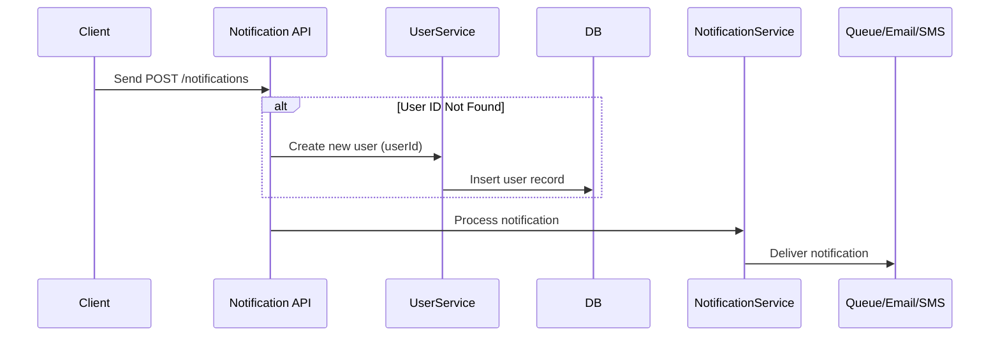

# Notification Service

A robust and scalable microservice for sending notifications via **Email**, **SMS**, and **In-App messages**. Built using **Spring Boot**, integrated with **RabbitMQ**, **Twilio**, and **SMTP** for efficient and asynchronous communication.

Hosted on **Render** and ready to plug into your larger microservices architecture.

---

## 🌐 Live URL

> Base URL: `https://notification-service-3.onrender.com`

Use this URL to access all endpoints listed below.

---

## 📁 Project Structure

```plaintext
notificationservice/
├── config/                 # Twilio, SMTP, environment configs
├── controller/             # REST API endpoints
├── modal/                  # Java models/entities (User, Notification, etc.)
├── queue/                  # RabbitMQ message producers
├── repo/                   # Spring Data JPA Repositories
├── service/                # Notification service logic
└── NotificationServiceApplication.java  # Main Spring Boot application
```

---

## 🚀 Features

* Send single or bulk notifications
* Supports Email, SMS (via Twilio), and In-App messages
* RabbitMQ for async queuing
* Spring Boot + Spring Data JPA + Neon/PostgreSQL
* Configurable templates and payloads

---

## ⚙️ Setup Instructions

```bash
# Clone the repo
https://github.com/raja2576/notification-Service.git

# Navigate to the project directory
cd notificationservice

# Build the project
./mvnw clean install

# Run the application
./mvnw spring-boot:run

# App will be accessible at:
http://localhost:8080
```

**Environment Variables (set in .env file):**

```properties
spring.datasource.url=jdbc:postgresql://your-db-url
spring.datasource.username=your-db-user
spring.datasource.password=your-db-password
twilio.account.sid=your_twilio_sid
twilio.auth.token=your_twilio_auth_token
twilio.phone.number=+1XXXXXXXXXX
```

---

## 📬 API Documentation

### 1. **Send Notification**

* **POST** `/notifications`
* Send email, SMS, or in-app message to a single user

**Request Body:**

```json
{
  "userId": "Atul",
  "type": "email",
  "subject": "Test Notification",
  "message": "This is a test message.",
  "email": "atul5465king@gmail.com"
}
```

> For `type = sms`, include `"phone": "7979098537"`

**Response:**

```
200 OK
Notification queued
```

### 2. **Send Bulk Notification**

* **POST** `/notifications/bulk`
* Notify multiple users at once

**Request Body:**

```json
{
  "userIds": ["Atul", "user999"],
  "type": "email",
  "subject": "Flash Sale!",
  "message": "Get 50% off today only!"
}
```

**Response:**

```
200 OK
Bulk notification sent successfully.
```

### 3. **Get User Notifications**

* **GET** `/notifications/users/{userId}`
* Fetch all in-app messages for a user

**Request:**

```
GET /notifications/users/Atul
```

**Response:**

```json
[
  "Welcome to the Notification Service!",
  "Your order has been delivered.",
  "Flat 50% discount only today!"
]
```

### 4. **Health Check Endpoint (Optional)**

* **GET** `/health`
* Verify if the service is up

**Response:**
 
```
200 OK
Notification Service is up and running!
```

---

## 📸 Screenshots

> *Add screenshots here of Postman tests or UI (if available)*

---

## 🧠 Assumptions

* Users exist in the database before sending notifications.
*---

### 🆕 Automatic User Registration

If a notification is sent to a user ID that is not already registered in the system, the service will **automatically create the user** in the database before sending the notification. This helps reduce the overhead of pre-registering users and supports seamless integration with external systems.

✅ **Supported For:**

* Email Notifications
* SMS Notifications
* In-App Notifications

🔄 **Workflow Example:**



📦 **Sample Request:**

```json
{
  "userId": "newUser123",
  "type": "sms",
  "subject": "Welcome!",
  "message": "You are now registered and this is your first notification.",
  "phone": "+919999999999"
}
```

📝 **Note:**

* The `userId`, `email`, or `phone` is used to auto-create the user.
* Duplicate `userId`s will not be re-created — the system checks for existence before insert.

---

* SMS and Email require phone and email respectively.
* RabbitMQ and Twilio credentials are correctly configured.
* In-app messages are stored for audit/log purposes.

---

## 🔮 Future Enhancements

* Admin dashboard to view logs and notification history
* WebSocket push notifications for real-time updates
* Retry mechanism for failed notifications
* Localization support (multi-language templates)

---

## 🤝 Contact

**Developer:** Raja Kumar
**Email:** [raja2576@gmail.com](mailto:22052576@kiit.ac.in)
**GitHub:** [github.com/raja2576](https://github.com/raja2576)

---

> *This service is production-ready and can be integrated into any e-commerce, SaaS, or enterprise-level architecture.*
